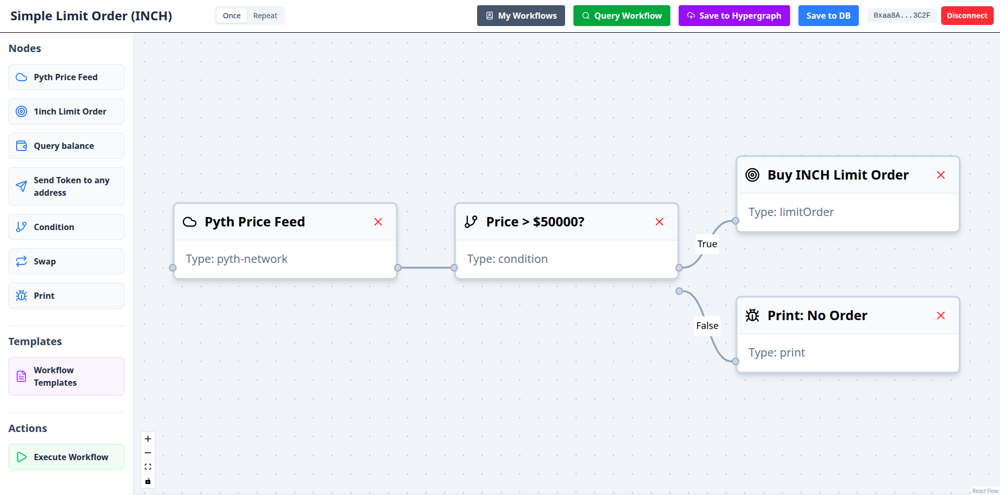

# d8n

**d8n** is the ultimate no-code DeFi workflow builder and executor. Unleash your creativity—design, automate, and execute complex DeFi logic with just drag-and-drop simplicity. If you can imagine it, you can build it!

## What is d8n?

d8n is a powerful automation tool that lets you create complex, conditional workflows for DeFi without writing a single line of code. From arbitrage strategies to automated payments, d8n provides a visual canvas to connect different DeFi protocols and services.

d8n turns long cross-chain tasks into automated, gasless profit and utility across Ethereum, as the engine handles the execution based on your predefined logic.

## 🚀 Key Features

### 1. Advanced DeFi Automation with Pyth Network
- **Query High-Frequency Data**: Access Pyth's real-time price feeds for crypto, equities, FX, and commodities to power your workflows. Use this data to trigger actions, make decisions, or calculate values.
- **Push Data On-Chain**: Uniquely, d8n workflows can also *push* data back to the Pyth network after execution, contributing to the robustness of the oracle.

### 2. Powerful Trading with the 1inch Limit Order Protocol
- **Build Advanced Strategies**: Create sophisticated trading hooks and strategies for the 1inch Limit Order Protocol.
- **Automate Limit Orders**: Set up workflows that automatically place, modify, or cancel limit orders based on market conditions or other on-chain events.

### 3. Composable & Shareable Workflows with The Graph
- **Store Workflows on Hypergraph**: Save your custom workflows as "black boxes" on The Graph's Hypergraph.
- **Create "DeFi Legos"**: This makes your workflows composable and shareable, allowing others to integrate your logic into their own systems, creating a true ecosystem of "DeFi legos."

## Youtube tutorial on d8n

## 🧩 How It Works
1.  **Frontend**: A user-friendly interface to build, test, and manage your workflows by dragging and dropping nodes.
2.  **Signer**: A secure component (like a browser extension) that captures your EIP-712 signature to authorize workflow execution.
3.  **Engine**: The decentralized backend that continuously monitors on-chain conditions, parses your workflow logic, and executes transactions when the predefined conditions are met.

## 💡 Why d8n?
- **No-Code Simplicity**: Build complex DeFi strategies without being a developer.
- **True Automation**: Set it once, and let the engine run it for you.
- **Composable & Open**: Share your workflows and use others' to build even more powerful systems.
- **Integrate Exclusive Features**: Leverage the best of Pyth, 1inch, and The Graph in one platform.

---
Ready to build the future of DeFi? Start creating with d8n today!
